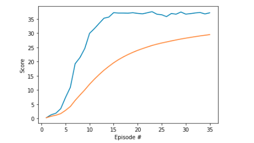
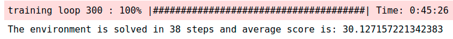

[//]: # (Image References)

[image1]: https://user-images.githubusercontent.com/10624937/43851024-320ba930-9aff-11e8-8493-ee547c6af349.gif "Trained Agent"
[image2]: https://user-images.githubusercontent.com/10624937/43851646-d899bf20-9b00-11e8-858c-29b5c2c94ccc.png "Crawler"

# Project 2: Continuous Control

### Introduction

This project implemented the Deep Deterministic Policy Gradient (DDPG) algorithm for training an agent to make the arms catching the balls correctly.This project is also a requirement from Udacity Reinforcement Learning program.

![Trained Agent][image1]

In this environment, a double-jointed arm can move to target locations. A reward of +0.1 is provided for each step that the agent's hand is in the goal location. Thus, the goal of your agent is to maintain its position at the target location for as many time steps as possible.

The observation space consists of 33 variables corresponding to position, rotation, velocity, and angular velocities of the arm. Each action is a vector with four numbers, corresponding to torque applicable to two joints. Every entry in the action vector should be a number between -1 and 1.

### Solving the Environment

#### Option 2: Solve the Second Version

The barrier for solving the second version of the environment is slightly different, to take into account the presence of many agents.  In particular, your agents must get an average score of +30 (over 100 consecutive episodes, and over all agents).  Specifically,
- After each episode, we add up the rewards that each agent received (without discounting), to get a score for each agent.  This yields 20 (potentially different) scores.  We then take the average of these 20 scores. 
- This yields an **average score** for each episode (where the average is over all 20 agents).

The environment is considered solved, when the average (over 100 episodes) of those average scores is at least +30. 

### Getting Started

1. Download the environment from one of the links below.  You need only select the environment that matches your operating system:

    - **_Version 1: One (1) Agent_**
        - Linux: [click here](https://s3-us-west-1.amazonaws.com/udacity-drlnd/P2/Reacher/one_agent/Reacher_Linux.zip)
        - Mac OSX: [click here](https://s3-us-west-1.amazonaws.com/udacity-drlnd/P2/Reacher/one_agent/Reacher.app.zip)
        - Windows (32-bit): [click here](https://s3-us-west-1.amazonaws.com/udacity-drlnd/P2/Reacher/one_agent/Reacher_Windows_x86.zip)
        - Windows (64-bit): [click here](https://s3-us-west-1.amazonaws.com/udacity-drlnd/P2/Reacher/one_agent/Reacher_Windows_x86_64.zip)

    - **_Version 2: Twenty (20) Agents_**
        - Linux: [click here](https://s3-us-west-1.amazonaws.com/udacity-drlnd/P2/Reacher/Reacher_Linux.zip)
        - Mac OSX: [click here](https://s3-us-west-1.amazonaws.com/udacity-drlnd/P2/Reacher/Reacher.app.zip)
        - Windows (32-bit): [click here](https://s3-us-west-1.amazonaws.com/udacity-drlnd/P2/Reacher/Reacher_Windows_x86.zip)
        - Windows (64-bit): [click here](https://s3-us-west-1.amazonaws.com/udacity-drlnd/P2/Reacher/Reacher_Windows_x86_64.zip)
    
    (_For Windows users_) Check out [this link](https://support.microsoft.com/en-us/help/827218/how-to-determine-whether-a-computer-is-running-a-32-bit-version-or-64) if you need help with determining if your computer is running a 32-bit version or 64-bit version of the Windows operating system.

    (_For AWS_) If you'd like to train the agent on AWS (and have not [enabled a virtual screen](https://github.com/Unity-Technologies/ml-agents/blob/master/docs/Training-on-Amazon-Web-Service.md)), then please use [this link](https://s3-us-west-1.amazonaws.com/udacity-drlnd/P2/Reacher/one_agent/Reacher_Linux_NoVis.zip) (version 1) or [this link](https://s3-us-west-1.amazonaws.com/udacity-drlnd/P2/Reacher/Reacher_Linux_NoVis.zip) (version 2) to obtain the "headless" version of the environment.  You will **not** be able to watch the agent without enabling a virtual screen, but you will be able to train the agent.  (_To watch the agent, you should follow the instructions to [enable a virtual screen](https://github.com/Unity-Technologies/ml-agents/blob/master/docs/Training-on-Amazon-Web-Service.md), and then download the environment for the **Linux** operating system above._)

2. Place the file in the DRLND GitHub repository, in the `p2_continuous-control/` folder, and unzip (or decompress) the file. 

3. Follow the steps in the original [DRLND repository](https://github.com/udacity/deep-reinforcement-learning#dependencies)  to download the required dependencies and set up an Anaconda environment with Python = 3.6. CAUTION: The python version must be `3.6` to avoid any confliction with the Unity Agent version of `0.4.0`. 
### Instructions

Follow the instructions in `Continuous_Control.ipynb` to get started with training your own agent. You can also run a pre-trained agent to evaluate its performance.

Some important files:
* `Continuous_Control.ipynb` --> The training and testing process.
* `Plotting.ipynb` --> For plotting
* `DDPG_Agent.py` --> The DDPG agent that handles the learning process.
* `DDPG_model.py` --> The Deep Q-learning Network architecture.
* `checkpoint_actor` --> The pre-trained parameters of the DDPG actor
* `checkpoint_critic` --> The pre-trained parameters of the DDPG critic
* `Test_model` --> The backup folder
* `REPORT.md` --> The report for this project.

### Training result

The agent converges very fast and get the  current point over 30 within just 10 episode and the average scores over 30.0 in just 36 episodes. Furthermore, the running time of training process is just `45 minutes`. 

### Testing result

The scores are very noisy but always greater than 30.0. Hence the average score is around `37.13`. When watching the agent plays in the GUI, we see that all the arms catching the green balls very well. 

# References

* [1] Lillicrap et. al.. [*Continuous control through deep reinforcement learning*](https://arxiv.org/pdf/1509.02971.pdf)
* [2] Silver et. al.. [*Deterministic Policy Gradients Algorithms*](http://proceedings.mlr.press/v32/silver14.pdf)
* [3] [DDPG implementation from Udacity](https://github.com/udacity/deep-reinforcement-learning/tree/master/ddpg-pendulum)
