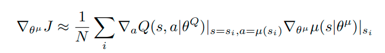
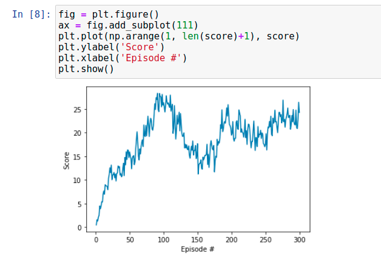
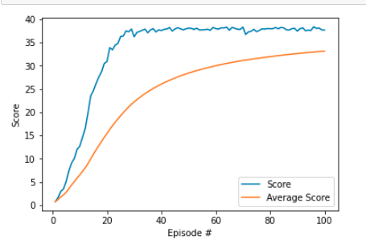
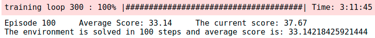
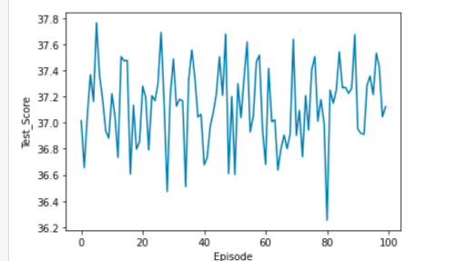

[//]: # (Image References)

[image1]: https://user-images.githubusercontent.com/10624937/43851024-320ba930-9aff-11e8-8493-ee547c6af349.gif "Trained Agent"
# Project Report: Continuous Control using Deep Deterministic Policy Gradient

## This report contains the following chapter:
* [Introduction](#Introduction)
* [Task Description](#Task-Description)
* [Algorithm](#Algorithm)
* [Implementation](#Implementation)
* [Further Development](#Further-Development)

## Introduction

In the recent years, Reinforcement Learning (RL) is a viral topic that has been researched and developed to solved various problem in the real world. In this project, we implemented an actor-critic RL method called Deep Deterministic Policy Gradient (DDPG) for training 20 virtual arms to reach the target ball.  

## Task description
### Given
![Trained Agent][image1]
* Twenty double-jointed arm can move to target locations.
* A reward of +0.1 is provided for each step that the agent's hand is in the goal location.
* Observation space consists of 33 variables corresponding to position, rotation, velocity, and angular velocities for each arms (20 states in total)
* Each action is a vector with four numbers, corresponding to torque applicable to two joints
* Every entry in the action vector should be a number between -1 and 1.

### Goal
* Train the agent to maintain position of 20 arms at the target location for as many time steps as possible.

* After each episode, we add up the rewards that each agent received (without discounting), to get a score for each agent.  This yields 20 (potentially different) scores.  We then take the average of these 20 scores. This yields an **average score** for each episode (where the average is over all 20 agents).

* The environment is considered solved, when the average (over 100 episodes) of those average scores is at least +30. 

## Algorithm
To solve this problem, we implement the Deep algorithm mentioned in Deep Deterministic Policy Gradient [1] and [2]. In that paper, they proposed using actor-critc method, which is a combination of two RL aproaches, for training an agent with continous action space. 

Basically, this algorithm is based on Deep Q-Learning mentioned in [3]. However in the vanila Deep Q-Learning the action space is discrete and the action is chosen based on the maximum of the Q_value of that state. In the DDPR, the action space is continous and approximated by a Deep Neural Network which is updated by the policy gradient method as followed: 



In short, the DDPR algorithm maintains four Neural Network. Two networks (local and target) for approximation the policy function used for choosing an action based on a given state (actor). Two networks (local and target) for approximation the Q_value function. These two networks are then used for validation the policy as mentioned before (critic).

## Implementation

To implement the aformentioned algorithm to this project, we re-used the implementation of DDPR from Udacity [4] with some modifications. 

### DDPR Model

Aformentioned, the DDPR used four networks in total. Two for actors and two for critics. However, in this project, the structure of those four networks are rather similiar with 1 input layer, 2 hidden layer and 1 output layer. The implementation of those models are stored in `DDPR_Model.py`.

#### Actor model 

```python
class Actor(nn.Module):
    """Actor (Policy) Model."""

    def __init__(self, state_size, action_size, seed, fc1_units=128, fc2_units = 128):
        super(Actor, self).__init__()
        self.seed = torch.manual_seed(seed)
        self.fc1 = nn.Linear(state_size, fc1_units)
        self.fc2 = nn.Linear(fc1_units, fc2_units)
        self.fc3 = nn.Linear(fc2_units, action_size)
        self.reset_parameters()

    def reset_parameters(self):
        self.fc1.weight.data.uniform_(*hidden_init(self.fc1))
        self.fc2.weight.data.uniform_(*hidden_init(self.fc2))
        self.fc3.weight.data.uniform_(-3e-3, 3e-3)

    def forward(self, state):
        x = F.relu(self.fc1(state))
        x = F.relu(self.fc2(x))
        return F.tanh(self.fc3(x))
```

As shown, the DNN of the Actor model has 4 layers: input layer (33), 2 hidden layers (128 each) and 1 output layer (4). Layer 1 and layer 2 is activated by Relu functions while the last layer used tanh function. We have tried increase the hidden layer size to 256 or 512 but it consumed more training time and even caused failure. 

#### Critic model 

```python
class Critic(nn.Module):
    """Critic (Value) Model."""

    def __init__(self, state_size, action_size, seed, fcs1_units=128, fc2_units=128):
        super(Critic, self).__init__()
        self.seed = torch.manual_seed(seed)
        self.fcs1 = nn.Linear(state_size, fcs1_units)
        self.fc2 = nn.Linear(fcs1_units+action_size, fc2_units)
        self.fc3 = nn.Linear(fc2_units, 1)
        self.reset_parameters()

    def reset_parameters(self):
        self.fcs1.weight.data.uniform_(*hidden_init(self.fcs1))
        self.fc2.weight.data.uniform_(*hidden_init(self.fc2))
        self.fc3.weight.data.uniform_(-3e-3, 3e-3)

    def forward(self, state, action):
        xs = F.leaky_relu(self.fcs1(state))
        x = torch.cat((xs, action), dim=1)
        x = F.leaky_relu(self.fc2(x))
        return self.fc3(x)
```

At the first glance, the Critic model is a little bit similar to the Actor model. However, the size of the layers are different. The state value is first processed in the first FCN and then concatinated with the action value in the second layer. The concatination value then goes through the second FCN and the third FCN. Finally, the Q_value of the action-state pair is given as the output of those layers.
### DQN Learning Agent

The whole learning agent code is placed in the file `DDPG_AGent.py` This is also based on the DDPR Implementation from Udacity [3]. The agent is considered as a class called DQN_agent with some important functions:

* step: Update the networks of the agent based on the given experience from the environment. This experience is also added to the memory `ReplayBuffer` for further randomly sample process. 
* act: Return an appropriate action based on the given state of the environment
* learn: The learning process is strictly follow the `DDPG algorithm` Algorithm described in [1]. In this function, four networks are considered: `actor_local`, `actor_target`,`critic_local`, `critic_target`. Those networks are grouped into two types: The local network used for training and the target network storing the delayed weights of the local network.  
* ReplayBuffer: To avoid the correlation between two consecutive action and state, the method of Experience Replay is introduced. By using step function, the experiences of the agent is stored in the ReplayBuffer. After that, the agent randomly choose a batch of expriences from this buffer and learn form them. 
* OU Noise: To add some randomness to the action of the arm, the Ornstein–Uhlenbeck [5] noise model is implmented as function `OUNoise`.
* Gradient Clipping used for stabilizing the critic model training. `CAUTION` This method is very important as it not only enhance the stability of the model but also increase the training speed.
```torch.nn.utils.clip_grad_norm_(self.critic_local.parameters(), 1)```
* soft_update: After each learning step, the target network is updated based on the value of the local network. However, instead of discarding all of the old values, a soft update function is implemented to combine the weighted old_value and new_value together. This will help to stabilize the training process. The function is as followed.


### Training Routine
The training routine is based on the algorithm as in [1]. and the implementation code from Udacity [3]. The training procedure is implemented in the notebook `Continuous_Control.ipynb` as followed.

```python
def DDPG_Learning(num_episode = 300, max_t = 1000):
    scores_windows = deque(maxlen = 100)
    scores_array = []
    print_every =  5
    timer1 = pb.ProgressBar(widgets=widget1, maxval=num_episode).start()
    for i_episode in range(1, num_episode+1):
        
        timer1.update(i_episode)
        env_info = env.reset(train_mode=True)[brain_name]     # reset the environment    
        states = env_info.vector_observations                  # get the current state (for each agent)
        scores = np.zeros(num_agents)                          # initialize the score (for each agent)
        agent.reset()                                         # Important: Reset the noise value
        for t in range(max_t):
            actions = agent.act(states)
            env_info = env.step(actions)[brain_name]           # send all actions to tne environment
            next_states = env_info.vector_observations         # get next state (for each agent)
            rewards = env_info.rewards                         # get reward (for each agent)
            dones = env_info.local_done                        # see if episode finished
            for i_agent in range(len(env_info.agents)):                      # update the network based on each agent
                agent.step(states[i_agent], actions[i_agent], rewards[i_agent], next_states[i_agent], dones[i_agent])
            
            scores += env_info.rewards                         # update the score (for each agent)
            states = next_states                               # roll over states to next time step
            if np.any(dones):                                  # exit loop if episode finished
                break
            
        avg_current_score = np.mean(scores)
        scores_windows.append(avg_current_score)
        scores_array.append(avg_current_score)
        if (i_episode % print_every == 0):
            torch.save(agent.actor_local.state_dict(), 'checkpoint_actor.pth')
            torch.save(agent.critic_local.state_dict(), 'checkpoint_critic.pth')
        if (np.mean(scores_windows)>= 30.0):
            print('The environment is solved in {} steps and average score is: {}'.format(i_episode, np.mean(scores_windows)))
            torch.save(agent.actor_local.state_dict(), 'checkpoint_actor.pth')
            torch.save(agent.critic_local.state_dict(), 'checkpoint_critic.pth')
            break
        
    timer1.finish()
    return scores_array     

score = DDPG_Learning(max_t = 1000)

```

In this project, we used only just `ONE AGENT` for twenty arms. In other words, the twenty arms use the networks of just one agent rather than creating the agent for each arm. Hence, the experiences are sharing among the arms increasing the learning ability of the agent.

The learning procedure for each episode begins with the reset of the environment, the reset of the agent and the initial state of 20  is observed. For each time step, an appropriate action is calculated by the agent based on the given state. Then, the agent used the tuple (state, action, reward, next_state, done) of each arms to update the weights of the neural network. In the end of each episode, the average score of 20 arms is calculated and appended to the running score window of length 100. If the mean value of this score window is greater than 30.0, the problem is considered as solved and vice versa. 
 
### Hyperparameter

The some hyperameter are set in the file `DDPG_agent.py` and described as follow:

```python
BUFFER_SIZE = int(1e6)  # replay buffer size
BATCH_SIZE = 128        # minibatch size
GAMMA = 0.99            # discount factor
TAU = 1e-3              # for soft update of target parameters
LR_ACTOR = 1e-4         # learning rate of the actor 
LR_CRITIC = 1e-4        # learning rate of the critic
WEIGHT_DECAY = 0  # L2 weight decay 0.001
UPDATE_EVERY = 20       # Update after t-step
NUM_UPDATE = 10           # Number of updates per step
```

The two later hyperparameters are significantly important as it decrease the learning time and ensure the convergence. 
## Result

After having set up and installed all the require packages as mentioned in the file `README.md`, the evaluation process of agent can be started by running the notebook `Continuous_Control.ipynb`.

### Training score

We have tried several times for finding the most suitable setting and parameter for this project. Most of the training effort consume a huge amount of times (around 18 hours) and even fail to converge. 

#### `UPDATE_EVERY = 1; NUM_UPDATE = 1`



As shown in the plot, the agent increase the score steadily but after 100 episodes, it starts falling off and cannot recover. The training time is 18 hours. 

#### `UPDATE_EVERY = 20; NUM_UPDATE = 10`


With this hyperparameters, the agent converges very fast and get the  instantaneous score over 30 within just 20 episode and the average scores over 30.0 in just 65 episodes. Furthermore, the running time of training process is just `3 hours`. Hence, we conclude this is the good parameter for this project. The "training loop 300" shown in the image is just a minor mistake in programming. 


### Testing score
In order to test the behavior of the trained agent, a testing process with 100 episode is executed. As can be seen from the graph below, the scores are very noisy but always greater than 30.0. Hence the average score is around `37.13`. When watching the agent plays in the GUI, we see that all the arms catching the green balls very well. 


# Further Development

Some developments could be made to enhance the performance of this DQN:

* Explore the effects of the gradient clipping methods in enhancing the stability of training process.
* Develop a new model but with the same agent and training process to solve the challenge of "Crawler Environment". 
* Implement and test some others algorithm such as Proximal Policy Optimization (PPO), Distributed Distributional Deterministic Policy Gradients (D4PG), A3C. 

# References

* [1] Lillicrap et. al.. [*Continuous control through deep reinforcement learning*](https://arxiv.org/pdf/1509.02971.pdf)
* [2] Silver et. al.. [*Deterministic Policy Gradients Algorithms*](http://proceedings.mlr.press/v32/silver14.pdf)
* [3] Mnih, Volodymyr & Kavukcuoglu, Koray & Silver, David, et. al.. [*Human-level control through deep-reinforcement learning*](https://storage.googleapis.com/deepmind-media/dqn/DQNNaturePaper.pdf)
* [4] [DDPG implementation from Udacity](https://github.com/udacity/deep-reinforcement-learning/tree/master/ddpg-pendulum)
* [5] [Ornstein–Uhlenbeck process](https://en.wikipedia.org/wiki/Ornstein%E2%80%93Uhlenbeck_process)