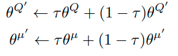

[//]: # (Image References)

[image1]: https://user-images.githubusercontent.com/10624937/42135619-d90f2f28-7d12-11e8-8823-82b970a54d7e.gif "Trained Agent"
[image2]: Q_learning.png "Q_learning"
# Project Report: Navigation in Banana unity enviroment using Deep Q-Learning Network 

## This report contains the following chapter:
* [Introduction](#Introduction)
* [Task Description](#Task-Description)
* [Algorithm](#Algorithm)
* [Implementation](#Implementation)
* [Further Development](#Further-Development)

## Introduction

In the recent years, Reinforcement Learning (RL) is a viral topic that has been researched and developed to solved various problem in the real world. In this project, we implemented a variant of the RL algorithm called Deep Q - Learning (DQN) to solve the task of Banana Collection. 

## Task description
### Given
![Trained Agent][image1]
* A large square world with random purple and yellow bananas.
* A reward of +1 is provided for collecting a yellow banana, and a reward of -1 is provided for collecting a blue banana.
* An agent with a state space of 37 dimensions and a action space of 4 dimesntion. 
* The state space including the agent's velocity, along with ray-based perception of objects around agent's forward direction.
* Four actions for the agent to choose based on the environment:
    - **`0`** - move forward.
    - **`1`** - move backward.
    - **`2`** - turn left.
    - **`3`** - turn right.

### Goal
* Train the agent to navigate and collect as many yellow bananas as possible while avoiding blue bananas to get the highest reward.
* The environment is considered as solved when agent get an average score of +13 over 100 consecutive episodes.

## Algorithm
To solve this problem, we implement the Deep Q - Learning algorithm mentioned in [1]. In that paper, they proposed a method to train an agent to play several Atari games and try to achieve highest possible scores. 

Basically, this algorithm is based on a Reinforcement learning tabular method called Q-learning. In this method, the Q value for each state-action pair is updated at each time step by the following formular:


However, the old Q-learning alogirthm used the a table to store all of the Q-value. This method is obviously not scaleable to larger state spaces, especially for the continous state. Hence, the authors in [1] has approximated the Q function with a Linear neural network model and then trained this model to attain the optimal Q value. This algorithm is called "Deep Q - Learning" (DQL). This procedure can be described by the loss function as follwed:


Furthermore, to solve the problem of half observed environment and enhance the end-to-end learning feature, the authors also implemented 2 layers of Convolution Neural Network to process the spatial information gathered from the raw image of the games. The full network of the model is shown in the following image:


## Implementation

To implement the aformentioned algorithm to this project, we must do some modification which is described in this section. 

### Deep Q-Learning Model

As mentioned, the state spaces of the environment has 37 dimensions with continous values and a action space of 4 dimensions. Hence, a fully connected network with input size of 37 and output size of 4 should be used. Furthermore, in constrast to the original algorithm of [1], no convolution layer is needed because we do not consider any image as input. 

The structure of this model is implemented in `DQN_model.py`. This code is based on the Udacity Q-network implementation [2] without major change. There are two 64 units hidden layers and each layer is activated by ReLU function. This model is built based on `pytorch` framework.


```python
class DQL_network(nn.Module):
    def __init__(self, state_values, action_values, seed, fc1_values = 64, fc2_values = 64):

        super(DQL_network, self).__init__()

        self.seed = torch.manual_seed(seed)
        self.fc1 = nn.Linear(state_values, fc1_values)
        self.fc2 = nn.Linear(fc1_values, fc2_values)
        self.fc3 = nn.Linear(fc2_values, action_values)

    def forward(self, state):
        x = F.relu(self.fc1(state))
        x = F.relu(self.fc2(x))
        return F.relu(self.fc3(x))
```

### DQN Learning Agent

The whole learning agent code is placed in the file `agent.py` This is also based on the Q-learning Implementation from Udacity. The agent is considered as a class called DQN_agent with some important functions:

* step: Update the networks of the agent based on the given experience from the environment. This experience is also added to the memory `ReplayBuffer` for further randomly sample process. 
* act: Return an appropriate action based on the given state of the environment
* learn: The learning process is strictly follow the `Deep Q-learning with experience replay` Algorithm described in [1]. In this function, two networks are considered: the local network `qnetwork_local` which is used for training and the target network `qnetwork_target` storing the delayed weights of the local network.  
* ReplayBuffer: To avoid the correlation between two consecutive action and state, the method of Experience Replay is introduced. By using step function, the experiences of the agent is stored in the ReplayBuffer. After that, the agent randomly choose a batch of expriences from this buffer and learn form them. 
* soft_update: After each learning step, the target network is updated based on the value of the local network. However, instead of discarding all of the old values, a soft update function is implemented to combine the weighted old_value and new_value together. This will help to stabilize the training process. The function is as followed.



### Training Routine
The training routine is based on the algorithm as in [2]. and the implementation code from Udacity. The training procedure is implemented in the notebook `Navigation.ipynb` as followed.

```python
def DQN_training(env, episode_num = 2000, max_time = 1000, eps_start = 1.0, eps_end = 0.01, eps_decay = 0.99):
    scores = []
    scores_windows = deque(maxlen = 100)
    eps = eps_start
    is_solved = False
    eps_solved = 0
    for episode in range(episode_num):
        start_time = time()
        env_info = env.reset(train_mode=True)[brain_name] # reset the environment
        state = env_info.vector_observations[0]            # get the current state
        score = 0 # initialize the score
        for t in range(max_time):
            #action = np.random.randint(action_size)        # select an action
            
            action = agent.act(state, eps)
            
            env_info = env.step(action)[brain_name]        # send the action to the environment
            
            next_state = env_info.vector_observations[0]   # get the next state
            reward = env_info.rewards[0]                   # get the reward
            done = env_info.local_done[0]                  # see if episode has finished
            score += reward                                # update the score
            
            agent.step(state, action, reward, next_state, done) #update the parameter
            
            #print(stop_time - start_time)
            state = next_state                             # roll over the state to next time step
            if done:                                       # exit loop if episode finished
                break
        scores.append(score)
        scores_windows.append(score)
        eps = max(eps*eps_decay, eps_end)
        
        ends = '' if not (episode % 100 == 0) else '\n'
        stop_time = time()
        delta_time = stop_time - start_time
        print('\rEpisode: {}\tAverageScores: {:.2f}. Time/episode: {:.2f}'.format(episode, np.mean(scores_windows),delta_time), end = ends )
        if(np.mean(scores_windows)>= 13.0 and not is_solved): #Terminated condition
            torch.save(agent.qnetwork_local.state_dict(), 'Checkpoint_DQN.pth')
            eps_solved = episode
            is_solved = True
            #break
    print('\rThe algorithm is solved in : {} and average is: {:.2f}'.format(eps_solved, np.mean(scores)))    
    return scores
```
The learning procedure for each episode begins with the reset of the environment and the initial state is observed. For each time step, an appropriate action is calculated by the agent based on the given state. Then, the agent used the tuple (state, action, reward, next_state, done) to update the weights of the neural network. In the end of each episode, the total score is calculated and appended to the running score window of length 100. If the mean value of this score window is greater than 13.0, the problem is considered as solved and vice versa. 

Furthermore, to balance between two processes `exploration` and `exploitation` of the agent, the epsilon-greedy algorithm is used with a decay factor of `eps_decey`. 
### Hyperparameter

The some hyperameter are set in the file `agent.py` and described as follow:

```python
BUFFER_SIZE = int(1e5)  # replay buffer size
BATCH_SIZE = 64         # minibatch size
GAMMA = 0.99            # discount factor
TAU = 1e-3              # for soft update of target parameters
LR = 5e-4               # learning rate 
UPDATE_EVERY = 4        # how often to update the network
```
## Result

After having set up and installed all the require packages as mentioned in the file `README.md`, the evaluation process of agent can be started by running the notebook `Navigation.ipynb`.

### Training score
As can be seen in the below figure, the problem is sovled in around 436 episodes and the total average of 14.12 point. In order to investigate the saturated value of the agent, the training process keeps running until 2000 episodes. With the maximum timestep of 1000 for each episode, the training scores are saturated at some value around 15-16 and very noisy. Hence, some methods should be implemented to suppress the noise in the training steps. 


Furthermore, the `eps_decay` variable plays an important role in the convergence time of the algorithm. When its very large as in `0.9999`, the environment can not be sovled. The recomendation value for this value is in the range between `0.98` and `0.99`.

### Testing score
In order to test the behavior of the trained agent, a testing process with 100 episode is executed. As can be seen from the graph below, the scores are very noisy and the average score is around `11.04`. When watching the agent plays in the GUI, we see that sometime the agent is stuck in a local minima by the surrounding purple bananas and make some oscillations. 


# Further Development

Some developments could be made to enhance the performance of this DQN:

* Instead of randomly choosing the batch from the ReplayBuffer, we may choose the experience based on its importance as described in the algorithm Priotized Experience Replay.
* Develop a new model but with the same agent and training process to solve the challenge of "Learning from Pixels". In this challenge, the state spaces are now the raw images, hence we need to add some `CNN` Layers to the Q-model.
* Implement and test some DQN-based algorithm such as Dueling DQN, Rainbow, Noisy DQN.

# References

* [1] Mnih, Volodymyr & Kavukcuoglu, Koray & Silver, David, et. al.. [*Human-level control through deep-reinforcement learning*](https://storage.googleapis.com/deepmind-media/dqn/DQNNaturePaper.pdf)
* [2] [DQN lunar-lander implementation from Udacity](https://github.com/udacity/deep-reinforcement-learning/tree/master/dqn/solution)